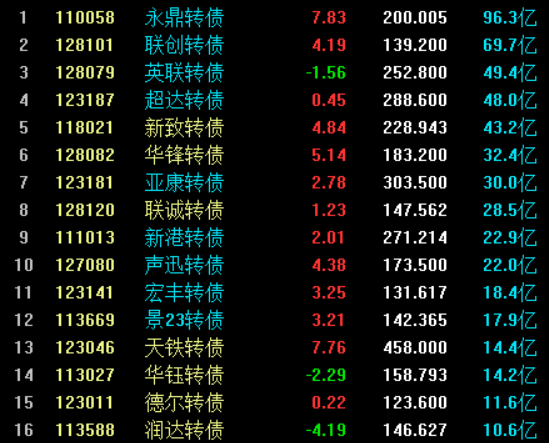
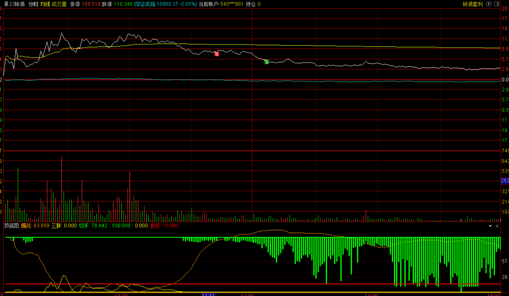

# 20230706

今天第一次尝试做kzz的超跌反转, 交了几千学费. 回测和实盘有一定差距, 同时实盘处理的时候还是存在一些心理和方法上的瑕疵.

* 首先是交易成功后, 需要设置一个条件单, 避免单只zz回撤过大.这个是后面交易必须做的事情.

## 当日盈亏情况

|kzz|成本|卖出价|盈亏比|盈亏|
|---|---|---|---|---|
|声讯转债|178|172.841||-972.7|
|联创转债|140.5|139||-730.89|
|景23转债|148.7|145.71||-670.75|
|英联转债|256.9|254.4||-516.01|
|新港转债|268.419|265||-281.87|
|超达转债|290.7|294.36||+413.62|

## 当日kzz成交额排行

## 分析交易心理

### 声讯转债

声讯早盘开的太强 直冲10几个点, 给人的预期过强.

* 早盘前几分钟太强的kzz是要小心谨慎一点的. 如果出现快速回落, 需要小心参与. 
* 如果真的需要介入, 需要仔细观察介入后个股反弹的幅度, 如果幅度不大, 交易量也跟不上, 这时候要考虑出局了.
* 最好是不要参与开盘几分钟过于激烈然后也没有持续性的zz.

### 联创转债
联创今天的表现是很强的 早盘第一波后还有第二波 所以想介入的欲望很强烈 觉得能企稳反弹.

* 最大的问题是已经打过二波了 资金的可持续性消失了 没有人会再回补仓位了.
* 介入点没有问题, 问题在于后面不该补仓 正常条件单止损了就行了 否则会加剧损失

### 景23转债
景哥表现也非常强势 能在高位强震荡这么久 这笔买卖是必须要做的 损失了也正常 注意做好止损.

### 英联转债

* 和联特一样 二次结构没有人再回补仓位 最好不参与 直接回避

### 新港转债
这个zz和声讯的问题一样 早盘太强 后面垮得太快 不应该介入这种zz.

### 超达转债
非常符合交易模式

### 永鼎转债
今日第一可惜.
永鼎按照风格是一定要做的 然而当时手上被联特被迷惑住了.

### 华锋转债
今日第二可惜.

## 总结

* 条件单要直接开起来 避免没有及时止损的问题.
* 不要做开局强势又迅速回落不再抬起来的.
* 二次结构一定要谨慎 最好是不做.

